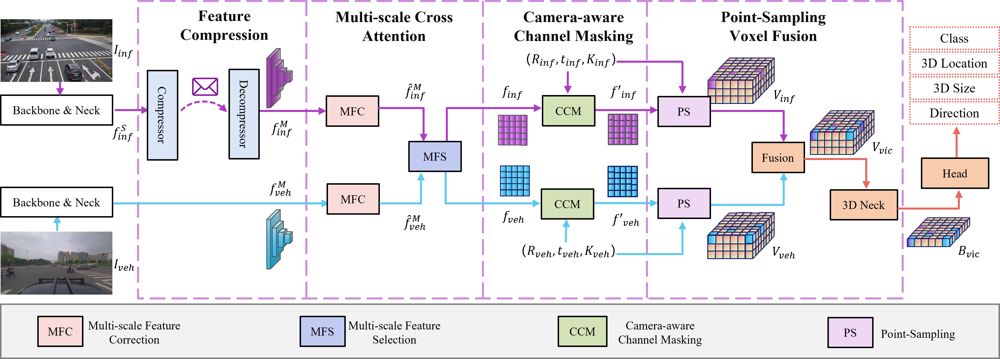

# EMIFF: Enhanced Multi-scale Image Feature Fusion for Vehicle-Infrastructure Cooperative 3D Object Detection

### [Project page](https://github.com/Bosszhe/EMIFF) | [Paper](https://arxiv.org/abs/2303.10975) |

>EMIFF: Enhanced Multi-scale Image Feature Fusion for Vehicle-Infrastructure Cooperative 3D Object Detection
Zhe Wang, Siqi Fan, Xiaoliang Huo, Tongda Xu, Yan Wang, Jingjing Liu, Yilun Chen, Ya-Qin Zhang.ICRA 2024.

This repository contains the official Pytorch implementation of training & evaluation code and the pretrained models for [EMIFF/VIMI](https://arxiv.org/abs/2303.10975).


## Abstract

In autonomous driving, cooperative perception makes use of multi-view cameras from both vehicles and infrastructure, providing a global vantage point with rich semantic context of road conditions beyond a single vehicle viewpoint. Currently, two major challenges persist in vehicle-infrastructure cooperative 3D (VIC3D) object detection: $1)$ inherent pose errors when fusing multi-view images, caused by time asynchrony across cameras;  $2)$ information loss in transmission process resulted from limited communication bandwidth.
To address these issues, we propose a novel camera-based 3D detection framework for VIC3D task, Enhanced Multi-scale Image Feature Fusion (EMIFF).
To fully exploit holistic perspectives from both vehicles and infrastructure, we propose Multi-scale Cross Attention (MCA) and Camera-aware Channel Masking (CCM) modules to enhance infrastructure and vehicle features at scale, spatial, and channel levels to correct the pose error introduced by camera asynchrony. We also introduce a Feature Compression (FC) module with channel and spatial compression blocks for transmission efficiency. Experiments show that EMIFF achieves SOTA on DAIR-V2X-C datasets, significantly outperforming previous early-fusion and late-fusion methods with comparable transmission costs.


## Methods



<!-- ## VIMI_Performance
* DAIR-V2X-C


* Compression Impact

<!--  -->

<!--   -->


## Get Started


- [Installation](docs/en/install.md)
- [Prepare Dataset](docs/en/prepare_dataset.md)
- [Train and Test](docs/en/train_test.md)


## Benchmark and Model Zoo

>Modality:Image

| Fusion  | Method| Dataset   | AP-3D (IoU=0.5)  | AP-BEV (IoU=0.5) |Config|DownLoad| 
| :-----: | :--------: | :-------: | :----: | :----: | :----: | :-----: |     
| VehOnly | ImvoxelNet | VIC-Sync  |   7.29 | 8.85   | [config](cfgs/vic/vic_i/vic_coop_v_imvoxelnet.py)   |\ |
| InfOnly | ImvoxelNet | VIC-Sync  |   8.66 | 14.41  | [config](cfgs/vic/vic_i/vic_coop_i_imvoxelnet.py)    |\ |
| Late-Fusion | ImvoxelNet | VIC-Sync  | 11.08 | 14.76 |     \ |  \  |
| Early-Fusion | BEVFormer_S | VIC-Sync  | 8.80   | 13.45 |  [config](cfgs/vic/vicfuser_deform_base_r50_960x540_12e_bs1.py) | [model/log](https://drive.google.com/drive/folders/1wx5wtJ1Cwc30EhSgNZymyl4HrSjz9MXZ?usp=drive_link)|      
| Early-Fusion | ImVoxelNet | VIC-Sync  |  12.72  | 18.17 |  [config](cfgs/vic/vicfuser_voxel/vicfuser_voxel_r50_960x540_12e_bs2.py) | [model/log](https://drive.google.com/drive/folders/1wx5wtJ1Cwc30EhSgNZymyl4HrSjz9MXZ?usp=drive_link)|  
| Intermediate-Fusion| EMIFF | VIC-Sync  | 15.61   | 21.44 | [config](cfgs/vic/vimi_960x540_12e_bs2.py)  |  [model/log](https://drive.google.com/drive/folders/1wx5wtJ1Cwc30EhSgNZymyl4HrSjz9MXZ?usp=drive_link)  |             

> We evaluate VehOnly/InfOnly/Late-Fusion model following [OpenDAIRV2X](https://github.com/AIR-THU/DAIR-V2X).

## Acknowledgement

This project is not possible without the following codebases.
* [OpenDAIRV2X ](https://github.com/AIR-THU/DAIR-V2X/tree/main)
*  [MMDetection3D](https://github.com/open-mmlab/mmdetection3d)
<!-- * [pypcd](https://github.com/dimatura/pypcd) -->


## Citation

If you find our work useful in your research, please consider citing:

```
@misc{wang2023vimi,
      title={VIMI: Vehicle-Infrastructure Multi-view Intermediate Fusion for Camera-based 3D Object Detection}, 
      author={Zhe Wang and Siqi Fan and Xiaoliang Huo and Tongda Xu and Yan Wang and Jingjing Liu and Yilun Chen and Ya-Qin Zhang},
      year={2023},
      eprint={2303.10975},
      archivePrefix={arXiv},
      primaryClass={cs.CV}
}

@inproceedings{wang2024emiff,
      title={EMIFF: Enhanced Multi-scale Image Feature Fusion for Vehicle-Infrastructure Cooperative 3D Object Detection}, 
      author={Zhe Wang and Siqi Fan and Xiaoliang Huo and Tongda Xu and Yan Wang and Jingjing Liu and Yilun Chen and Ya-Qin Zhang},
      booktitle = {2024 IEEE International Conference on Robotics and Automation (ICRA)},
      year = {2024}}
}
```
