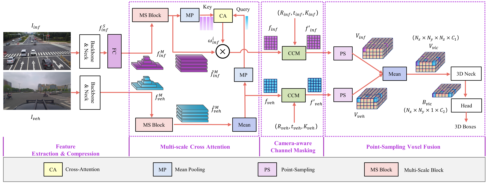
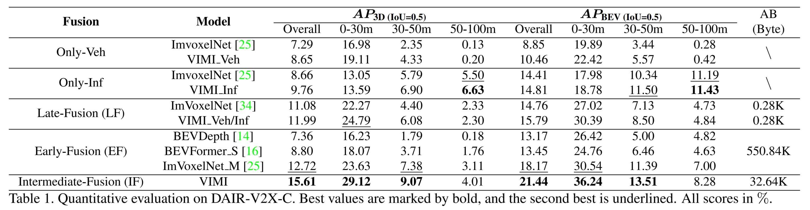

# VIMI: Vehicle-Infrastructure Multi-view Intermediate Fusion for Camera-based 3D Object Detection

## Abstract

In autonomous driving, Vehicle-Infrastructure Cooperative 3D Object Detection (VIC3D) makes use of multi-view cameras from both vehicles and traffic infrastructure, providing a global vantage point with rich semantic context of road conditions beyond a single vehicle viewpoint. Two major challenges prevail in VIC3D: 1) inherent calibration noise when fusing multi-view images, caused by time asynchrony across cameras; 2) information loss when projecting 2D features into 3D space. To address these issues, We propose a novel 3D object detection framework, Vehicles-Infrastructure Multi-view Intermediate fusion (VIMI). First, to fully exploit the holistic perspectives from both vehicles and infrastructure, we propose a Multi-scale Cross Attention (MCA) module that fuses infrastructure and vehicle features on selective multi-scales to correct the calibration noise introduced by camera asynchrony. Then, we design a  Camera-aware Channel Masking (CCM) module that uses camera parameters as priors to augment the fused features. We further introduce a Feature Compression (FC) module with channel and spatial compression blocks to reduce the size of transmitted features for enhanced efficiency. Experiments show that VIMI achieves 15.61% overall AP_3D and 21.44% AP_BEV on the new VIC3D dataset, DAIR-V2X-C, significantly outperforming state-of-the-art early fusion and late fusion methods with comparable transmission cost.


## Code

**Code and pretrained models will be released upon publication.**

## VIMI_Architecture



## VIMI_Performance
* DAIR-V2X-C



* Compression Impact

<!--  -->


## Citation

If you find our work useful in your research, please consider citing:

```
@article{spidermesh,
  title={{VIMI}: Vehicle-Infrastructure Multi-view Intermediate Fusion for Camera-based 3D Object Detection},
  author={Z. Wang and S. Fan and Y. Wang and J. Liu},
  journal={arXiv:2303.08692},
  year={2023}}
```
